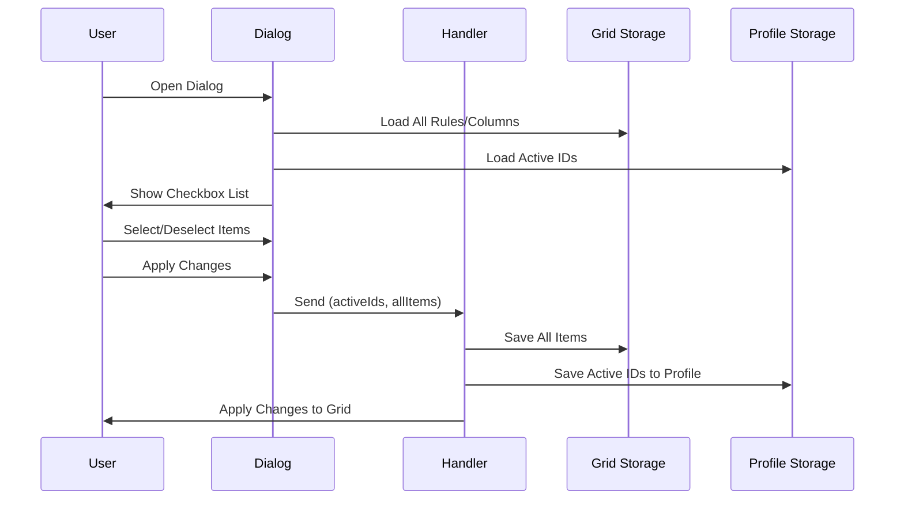
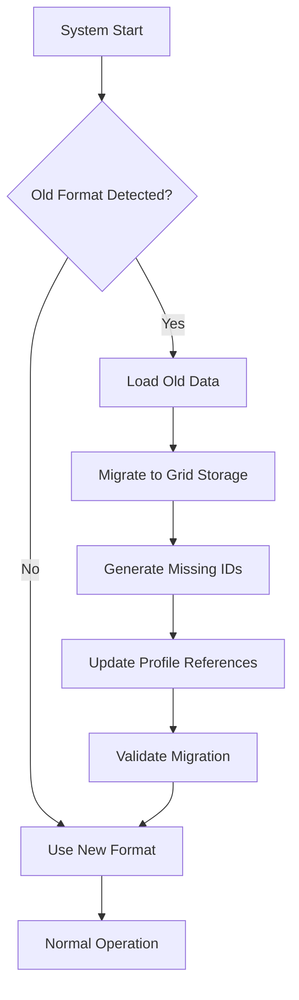

# Design Document

## Overview

This design implements a consistent grid-level storage architecture for conditional formatting rules and calculated columns, following the exact same pattern as the existing column groups implementation. The architecture separates storage (grid-level) from application (profile-level references), enabling efficient sharing and reuse while maintaining profile-specific configurations.

## Architecture

### Storage Architecture

The new architecture follows the established column groups pattern:

```
Grid Level Storage (localStorage):
├── grid_conditional_formatting_{gridInstanceId}
│   └── { version, rules: ConditionalFormattingRule[], timestamp }
├── grid_calculated_columns_{gridInstanceId}
│   └── { version, columns: CalculatedColumnDefinition[], timestamp }
└── grid_column_groups_{gridInstanceId} (existing)
    └── { version, groups: ColumnGroup[], timestamp }

Profile Level References:
├── profile.conditionalFormattingRules: string[] (rule IDs)
├── profile.calculatedColumns: string[] (column IDs)
└── profile.columnGroups: string[] (group IDs) (existing)
```

### Data Flow

1. **Storage**: All rules/columns stored once per grid instance
2. **Reference**: Profiles store only IDs of active items
3. **Resolution**: System resolves IDs to full objects when needed
4. **Application**: Only active items are applied to the grid

## Components and Interfaces

### Grid Storage Services

#### GridConditionalFormattingStorage

```typescript
export class GridConditionalFormattingStorage {
  private static readonly STORAGE_KEY_PREFIX = 'grid_conditional_formatting_';
  
  // Core CRUD operations
  static loadRules(gridInstanceId: string): ConditionalFormattingRule[]
  static saveRules(gridInstanceId: string, rules: ConditionalFormattingRule[]): void
  static saveRule(gridInstanceId: string, rule: ConditionalFormattingRule): void
  static deleteRule(gridInstanceId: string, ruleId: string): void
  
  // Query operations
  static getRule(gridInstanceId: string, ruleId: string): ConditionalFormattingRule | null
  static getRules(gridInstanceId: string, ruleIds: string[]): ConditionalFormattingRule[]
  static hasRule(gridInstanceId: string, ruleId: string): boolean
  static getAllRuleIds(gridInstanceId: string): string[]
  
  // Utility operations
  static clearRules(gridInstanceId: string): void
  static migrateFromGlobalRules(gridInstanceId: string, globalRules: ConditionalFormattingRule[]): string[]
}
```

#### GridCalculatedColumnsStorage

```typescript
export class GridCalculatedColumnsStorage {
  private static readonly STORAGE_KEY_PREFIX = 'grid_calculated_columns_';
  
  // Core CRUD operations
  static loadColumns(gridInstanceId: string): CalculatedColumnDefinition[]
  static saveColumns(gridInstanceId: string, columns: CalculatedColumnDefinition[]): void
  static saveColumn(gridInstanceId: string, column: CalculatedColumnDefinition): void
  static deleteColumn(gridInstanceId: string, columnId: string): void
  
  // Query operations
  static getColumn(gridInstanceId: string, columnId: string): CalculatedColumnDefinition | null
  static getColumns(gridInstanceId: string, columnIds: string[]): CalculatedColumnDefinition[]
  static hasColumn(gridInstanceId: string, columnId: string): boolean
  static getAllColumnIds(gridInstanceId: string): string[]
  
  // Utility operations
  static clearColumns(gridInstanceId: string): void
  static migrateFromProfileColumns(gridInstanceId: string, profileColumns: CalculatedColumnDefinition[]): string[]
}
```

### Enhanced Data Models

#### ConditionalFormattingRule (Enhanced)

```typescript
interface ConditionalFormattingRule {
  id: string;                    // Unique identifier
  name: string;                  // Display name
  condition: string;             // Condition expression
  style: CSSProperties;          // Applied styles
  columns?: string[];            // Target columns (optional)
  enabled: boolean;              // Rule enabled state
  createdAt: number;            // Creation timestamp (NEW)
  updatedAt: number;            // Last modified timestamp (NEW)
  description?: string;          // Optional description (NEW)
}
```

#### CalculatedColumnDefinition (Enhanced)

```typescript
interface CalculatedColumnDefinition {
  id: string;                    // Unique identifier
  field: string;                 // Column field name
  headerName: string;            // Display header
  expression: string;            // Calculation expression
  cellDataType?: string;         // Data type
  pinned?: 'left' | 'right';    // Pin position
  width?: number;               // Column width
  valueFormatter?: string;       // Value formatter
  createdAt: number;            // Creation timestamp (NEW)
  updatedAt: number;            // Last modified timestamp (NEW)
  description?: string;          // Optional description (NEW)
}
```

#### Profile Structure (Updated)

```typescript
interface DataGridStompSharedProfile extends BaseProfile {
  // ... existing fields
  columnGroups?: string[];                    // Column group IDs (existing)
  conditionalFormattingRules?: string[];     // Conditional formatting rule IDs (NEW)
  calculatedColumns?: string[];               // Calculated column IDs (CHANGED from objects to IDs)
}
```

### Handler Signature Updates

#### Before (Inconsistent)
```typescript
// Column groups (correct)
onApplyColumnGroups: (activeGroupIds: string[], allGroups: ColumnGroup[]) => void

// Conditional formatting (incorrect - global)
onApplyConditionalFormatting: (rules: ConditionalFormattingRule[]) => void

// Calculated columns (incorrect - profile-level)
onApplyCalculatedColumns: (columns: CalculatedColumnDefinition[]) => void
```

#### After (Consistent)
```typescript
// All follow the same pattern
onApplyColumnGroups: (activeGroupIds: string[], allGroups: ColumnGroup[]) => void
onApplyConditionalFormatting: (activeRuleIds: string[], allRules: ConditionalFormattingRule[]) => void
onApplyCalculatedColumns: (activeColumnIds: string[], allColumns: CalculatedColumnDefinition[]) => void
```

## Data Models

### Dialog Data Structure

#### Conditional Formatting Dialog
```typescript
interface ConditionalFormattingDialogData {
  columnDefs: ColDef[];                           // Available columns
  currentRules: ConditionalFormattingRule[];     // All available rules (grid-level)
  activeRuleIds: string[];                       // Currently active rule IDs (profile-level)
  profileName: string;                           // Current profile name
  gridInstanceId: string;                        // Grid instance identifier
}
```

#### Calculated Columns Dialog
```typescript
interface CalculatedColumnsDialogData {
  columnDefs: ColDef[];                          // Available columns
  currentColumns: CalculatedColumnDefinition[]; // All available columns (grid-level)
  activeColumnIds: string[];                     // Currently active column IDs (profile-level)
  profileName: string;                           // Current profile name
  gridInstanceId: string;                        // Grid instance identifier
}
```

### Dialog Response Structure

#### Conditional Formatting Response
```typescript
interface ConditionalFormattingResponse {
  activeRuleIds: string[];                       // Selected rule IDs
  allRules: ConditionalFormattingRule[];         // All rules (including new/modified)
}
```

#### Calculated Columns Response
```typescript
interface CalculatedColumnsResponse {
  activeColumnIds: string[];                     // Selected column IDs
  allColumns: CalculatedColumnDefinition[];      // All columns (including new/modified)
}
```

## Error Handling

### Storage Error Handling

```typescript
// Graceful fallback for storage errors
try {
  const rules = GridConditionalFormattingStorage.loadRules(gridInstanceId);
  return rules;
} catch (error) {
  console.error('Failed to load rules from grid storage:', error);
  // Fallback to empty array or migration attempt
  return [];
}
```

### Reference Resolution Error Handling

```typescript
// Handle missing references
const resolveRuleReferences = (ruleIds: string[], gridInstanceId: string): ConditionalFormattingRule[] => {
  const validRules: ConditionalFormattingRule[] = [];
  const invalidIds: string[] = [];
  
  ruleIds.forEach(id => {
    const rule = GridConditionalFormattingStorage.getRule(gridInstanceId, id);
    if (rule) {
      validRules.push(rule);
    } else {
      invalidIds.push(id);
      console.warn(`Rule reference not found: ${id}`);
    }
  });
  
  // Clean up invalid references from profile
  if (invalidIds.length > 0) {
    // Update profile to remove invalid references
    updateProfileReferences(invalidIds);
  }
  
  return validRules;
};
```

### Migration Error Handling

```typescript
// Safe migration with error recovery
const migrateWithErrorHandling = (gridInstanceId: string, oldData: any[]): string[] => {
  const migratedIds: string[] = [];
  
  oldData.forEach(item => {
    try {
      const migratedItem = {
        ...item,
        id: item.id || generateUniqueId(),
        createdAt: item.createdAt || Date.now(),
        updatedAt: Date.now()
      };
      
      GridConditionalFormattingStorage.saveRule(gridInstanceId, migratedItem);
      migratedIds.push(migratedItem.id);
    } catch (error) {
      console.error('Failed to migrate item:', item, error);
      // Continue with other items
    }
  });
  
  return migratedIds;
};
```

## Testing Strategy

### Unit Tests

1. **Storage Service Tests**
   - CRUD operations for both services
   - Error handling and edge cases
   - Migration functionality
   - Data validation

2. **Handler Tests**
   - Profile update logic
   - Reference resolution
   - Error scenarios

3. **Dialog Integration Tests**
   - Data structure validation
   - Response handling
   - State management

### Integration Tests

1. **End-to-End Workflow Tests**
   - Create rule/column → Save to grid → Apply to profile → Verify application
   - Cross-profile sharing scenarios
   - Migration from old format

2. **Performance Tests**
   - Profile switching speed
   - Large dataset handling
   - Memory usage optimization

### Migration Tests

1. **Data Migration Tests**
   - Global conditional formatting rules → Grid-level storage
   - Profile-level calculated columns → Grid-level storage
   - Mixed old/new format handling

2. **Backward Compatibility Tests**
   - Old format data handling
   - Graceful degradation
   - Data integrity preservation

## Implementation Phases

### Phase 1: Core Storage Services
- Create GridConditionalFormattingStorage
- Create GridCalculatedColumnsStorage
- Update type definitions
- Add migration methods

### Phase 2: Handler Updates
- Update conditional formatting handler
- Update calculated columns handler
- Update dialog management hooks
- Update main component integration

### Phase 3: Dialog Enhancements
- Add checkbox selection UI to conditional formatting dialog
- Add checkbox selection UI to calculated columns dialog
- Update dialog data structures
- Update response handling

### Phase 4: Migration Integration
- Add migration detection logic
- Integrate migration calls
- Update profile loading/saving
- Add cleanup procedures

### Phase 5: Testing and Optimization
- Comprehensive testing
- Performance optimization
- Error handling refinement
- Documentation updates

## Mermaid Diagrams

### Architecture Overview
```mermaid
graph TB
    subgraph "Grid Level Storage"
        GCF[grid_conditional_formatting_123]
        GCC[grid_calculated_columns_123]
        GCG[grid_column_groups_123]
    end
    
    subgraph "Profile Level References"
        P1[Profile 1<br/>ruleIds: [r1, r2]<br/>columnIds: [c1]<br/>groupIds: [g1]]
        P2[Profile 2<br/>ruleIds: [r2, r3]<br/>columnIds: [c1, c2]<br/>groupIds: [g2]]
        P3[Profile 3<br/>ruleIds: [r1]<br/>columnIds: [c2]<br/>groupIds: [g1, g2]]
    end
    
    subgraph "Application Layer"
        AR[Active Rules]
        AC[Active Columns]
        AG[Active Groups]
    end
    
    P1 --> AR
    P2 --> AR
    P3 --> AR
    
    P1 --> AC
    P2 --> AC
    P3 --> AC
    
    P1 --> AG
    P2 --> AG
    P3 --> AG
    
    GCF --> AR
    GCC --> AC
    GCG --> AG
```

### Data Flow Diagram


### Migration Flow


This design ensures complete consistency with the column groups architecture while providing enhanced functionality through checkbox selection interfaces and robust migration capabilities.