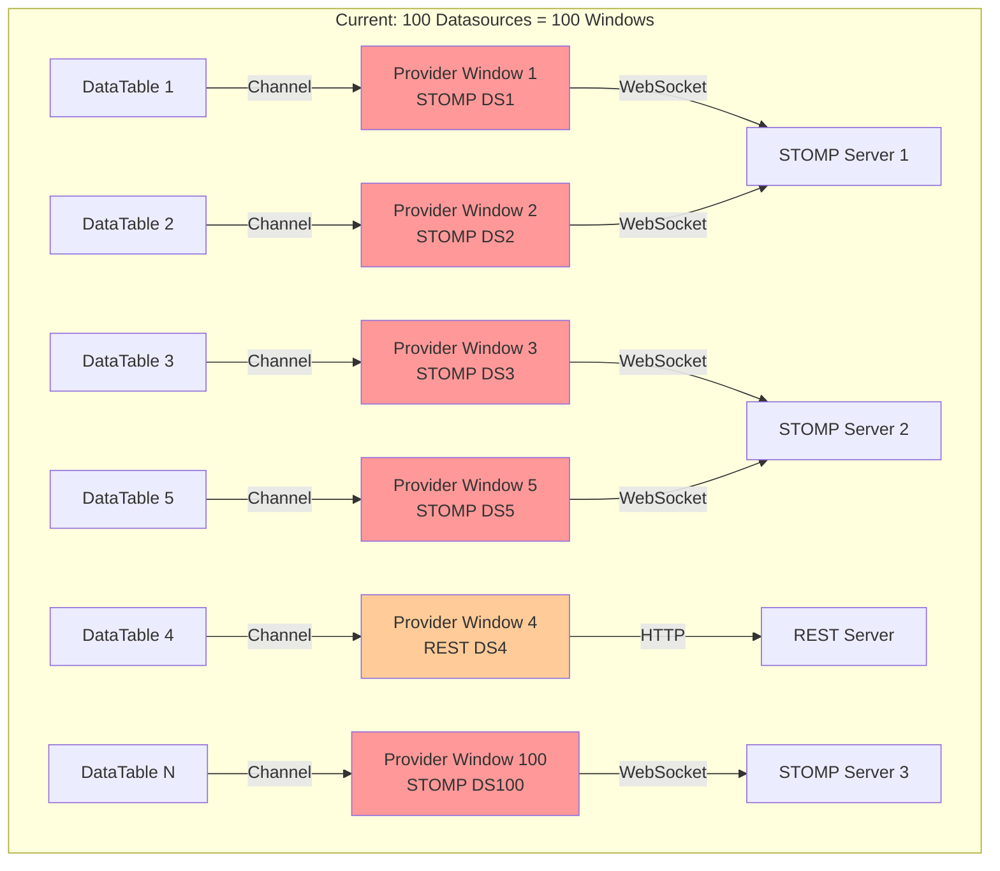
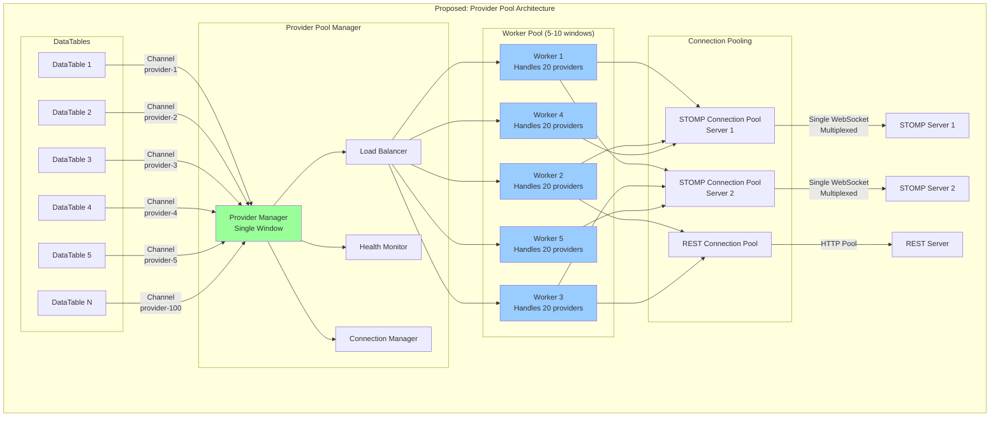
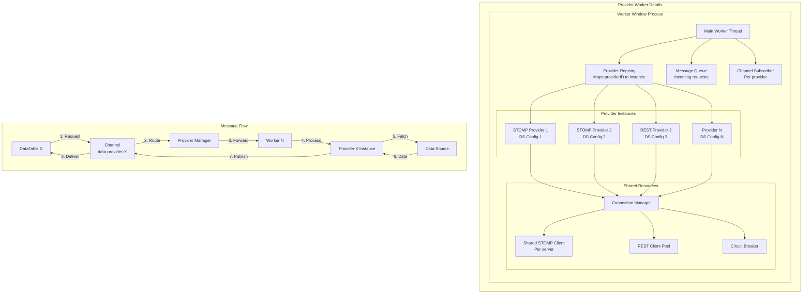
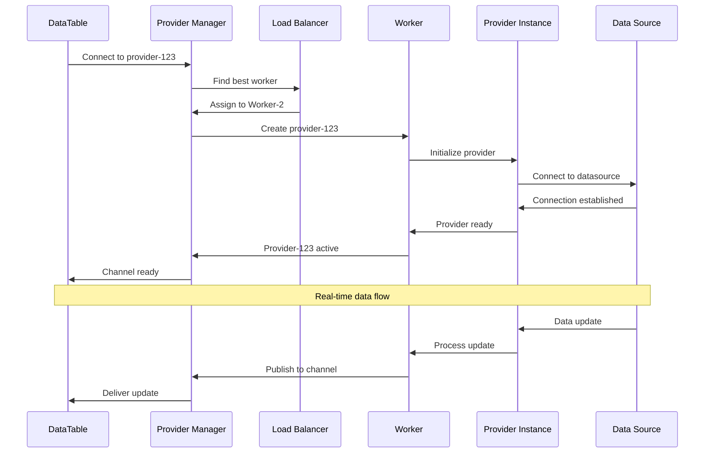

# Provider Architecture Comparison

## Current Architecture (One Window Per Provider)



### Problems:
- 100 separate OS windows
- High memory usage (each window ~50-100MB)
- OS window handle limits
- Difficult to manage and monitor
- No connection sharing

## Proposed Architecture (Provider Pool)



## Detailed Component Architecture



## Benefits of Provider Pool Architecture

### 1. **Resource Efficiency**
- 5-10 windows instead of 100
- Shared memory and connections
- ~80% reduction in resource usage

### 2. **Connection Pooling**
- Multiple providers share WebSocket connections
- Connection multiplexing for same servers
- Reduced network overhead

### 3. **Better Management**
- Centralized monitoring
- Easy health checks
- Graceful scaling

### 4. **Load Balancing**
- Even distribution across workers
- Dynamic rebalancing
- Failover support

### 5. **Performance**
- Reduced context switching
- Shared data caching
- Batch processing

## Implementation Strategy



## Configuration Example

```typescript
interface ProviderPoolConfig {
  pool: {
    minWorkers: 2,
    maxWorkers: 10,
    providersPerWorker: 20,
    workerIdleTimeout: 300000, // 5 minutes
    healthCheckInterval: 30000  // 30 seconds
  },
  connectionSharing: {
    enabled: true,
    maxConnectionsPerServer: 5,
    connectionIdleTimeout: 60000
  },
  loadBalancing: {
    strategy: 'round-robin', // or 'least-loaded'
    rebalanceThreshold: 0.8,
    rebalanceInterval: 60000
  }
}
```